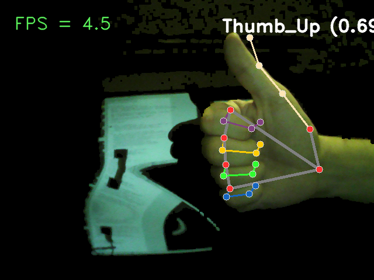

# Gesture Recognition AI Demo

Tested on Raspberry Pi 3B+ with Raspbian Bookworm (Debian 12.7) using a USB camera.  No AI accelerator card was used, Coral.AI is under consideration.

Note:  My code is MIT licensed, however some other code may be under different licenses.

### Demo 1

Demo from Random Nerd Tutorials.  Uses Google mediapipe and model to perform recognition of some gestures.

	https://RandomNerdTutorials.com/install-mediapipe-raspberry-pi/

Stats:

	* 1.8 to 3.1 frames per second (800 x 600)
 	* 3 to 5 frames per second (640 x 480)
	* Noticeable lag in processing (~20 seconds)

### Demo 2

Demo of improved AI method using pre-processing for background culling and image masking.  See the images directory for some example development pictures.

Stats:

	* 3 to 5 frames per second (640 x 480)
	* Noticeable lag in processing (~20 seconds, slightly less than the default in Demo 1)

Notes:

	* The performance gain was very slight.  This indicates most of the work is in the AI model processing.
 	* The next step should be model refinement.
  	* There were a lot of errors in the command window, cleaning these up should yield better performance.

 
### Demo 3

Demo of improved AI method: Trained ML on preprocessed images (next steps for this project).

Stats:

	* ? frames per second (800 x 600)
 	* ? frames per second (640 x 480)
	* ? lag in processing

### Instructions

	Git clone to desired directory.
	
	Run setup.sh
	
	Run the demo via "./run_demo1.sh" or "./run_demo2.sh"
	
	Enjoy!
